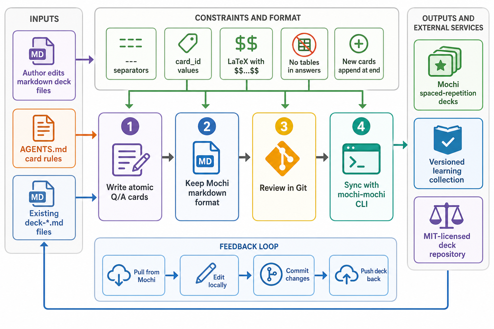

<div align="center">
  

  **🧠 Curated Mochi flashcard decks for AI/ML, data science, and mathematics 🃏**
</div>

mochidecks is a Git-tracked collection of markdown flashcard decks for [Mochi](https://mochi.cards). The decks are written for spaced repetition and are designed to sync with the [mochi-mochi](https://github.com/tsilva/mochi-mochi) CLI.

The repository currently contains 19 decks covering AI/ML fundamentals, neural networks, attention, GPT and BERT architecture, autoencoders, optimizers, gradient stability, KL divergence, linear algebra, and NumPy.

## Install

```bash
pip install mochi-mochi
git clone https://github.com/tsilva/mochidecks.git
cd mochidecks
```

Open any `deck-*.md` file in a text editor, or push a deck to Mochi:

```bash
mochi-mochi push deck-aiml-neural-networks-gkIM7hjD.md
```

## Commands

```bash
mochi-mochi pull <deck_id>        # download a deck from Mochi
mochi-mochi push <deck-file.md>   # sync a local deck file to Mochi
git status                        # review local deck edits
```

## Notes

- Deck files use `deck-{topic}-{id}.md` naming when they already exist in Mochi.
- New deck files should use `deck-{topic}.md` until Mochi assigns an ID.
- Cards use `---` separators, a `card_id` field, one question, and one answer.
- New cards belong at the end of a deck before the final `---`.
- Keep `card_id: null` for new cards; preserve existing IDs for typo-only edits.
- Use `$$...$$` for LaTeX and avoid tables in answers.
- This repository has no app build step or package manifest; the workflow is editing markdown and syncing decks.

## Architecture



## License

[MIT](LICENSE)
